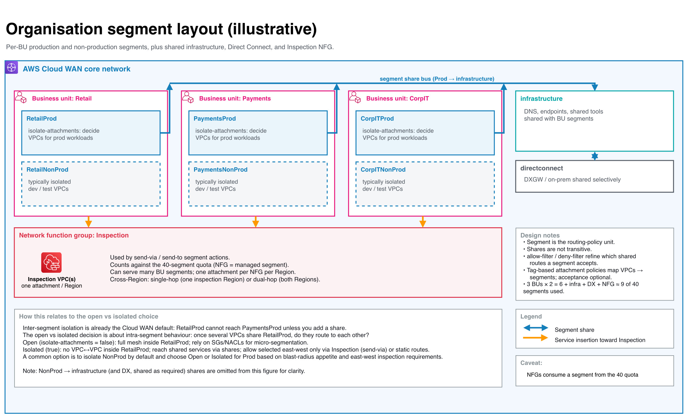
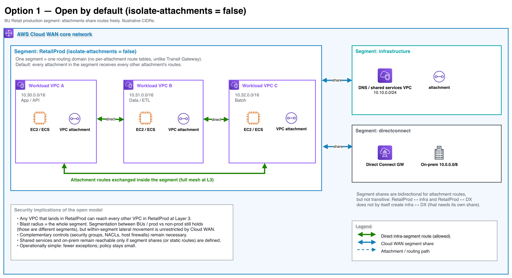
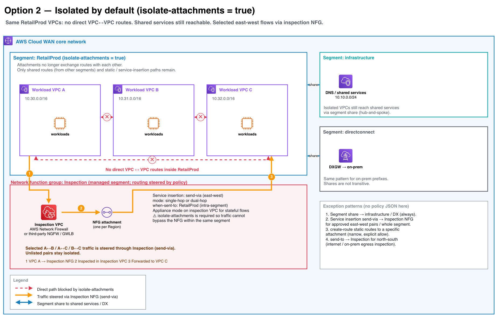

> Citation convention. [Sn] refers to the numbered source list. Items marked ⚠ Unverified could not be confirmed in AWS documentation.

## 1. Purpose and scope
This document answers a design question for Edward's AWS Organization and Cloud WAN estate:
Should VPCs attached to the same Cloud WAN segment be able to route to each other by default
(open), or should that be the inverse (isolated by default)?

### In scope

- Cloud WAN segment routing behaviour, including isolate-attachments.
- How isolated attachments still reach shared services and on-premises.
- How to allow selected intra-segment flows (static routes; service insertion).
- Governance: attachment acceptance, tag-based mapping, RAM sharing of the core network, IAM /
  SCP considerations.
- Complementary controls (security groups, NACLs, inspection, logging).
- Cost and operational trade-offs.
- A recommendation framed as considerations (not as an AWS mandate).

### Out of scope

- Example core network policy JSON (explicitly excluded). Setting names such as isolate-
  attachments are used in prose only.
- Application-layer zero trust beyond network controls.
- Detailed firewall rule design inside an inspection VPC.

The estate already uses (or will use) an infrastructure / DNS segment and a Direct Connect segment, plus production and non-production segments per business unit.

## 2. How Cloud WAN segments route

### 2.1 Segment = routing domain
A Cloud WAN segment is a dedicated routing domain: by default, only attachments within the same
segment can communicate. It is analogous to a globally consistent VRF or Layer-3 IP VPN. [S1][S2]

#### Important contrasts with AWS Transit Gateway:

|               | Transit Gateway        | Cloud WAN               |
| ------------- | ---------------------- | ----------------------- |
| Routing unit  | Multiple route tables per TGW; each attachment associates with a route table | The **segment** is the routing-policy unit |
| Per-attachment route tables | Yes | **No** — attachments in a segment share that segment's routes [S1][S2] |
| Cross-domain connectivity | Route-table associations + propagation / static routes | Segment **share** actions and static routes / service insertion [S3] |

There is **no** Cloud WAN feature that gives each VPC attachment its own route table inside a segment. If you need attachment A to reach B but not C, and all three are in the same segment with *isolate-attachments = false*, Cloud WAN alone cannot express that: you rely on VPC-level controls or you change the model (isolate + exceptions, or put C in another segment).

### 2.2 Default inter-segment behaviour
Attachments in different segments do not communicate unless you define a segment share (or static
routes / service insertion). Shares:
- Use action share with mode attachment-route.
- Place **attachment and return routes** into the peer segments.
- Are **not transitive**: sharing infrastructure with both RetailProd and PaymentsProd does not connect RetailProd to PaymentsProd. Static routes and routes learned from other shares are not passed through an attachment-route share. [S3]

Optional **allow-filter / deny-filter** on a segment further restrict which shared routes that segment will accept after shares are applied. You may use one or the other, not both. [S3]

### 2.3 isolate-attachments (default: false)
From the core network policy reference: [S3]
- **isolate-attachments**: boolean. Default **false**.
- When **true**, attachments on the **same** segment **cannot communicate with each other**. The only routes available are:
- routes **shared** from other segments (via segment-actions share), or
- **static** routes ( create-route).
- Documented example: a development segment that should never allow VPCs to talk to each other
even when they sit on the same segment.

AWS FAQs and the service-insertion documentation add: for **same-segment** service insertion (steering VPC↔VPC traffic through a network function group), you must enable isolate-attachments, otherwise attachments can communicate directly and bypass the inspection path. [S4][S5]

⚠️ **Documentation inconsistency (flagged).** The Network Manager console text for "Isolated attachments" says attachments in isolated segments "can't communicate with other segments". [S6] That wording conflicts with the policy-parameter reference and with FAQs (which describe intra-segment isolation while still allowing shared routes from other segments). This guide follows the **policy JSON reference and FAQs** [S3][S4][S5]. Treat the console sentence as potentially misleading until AWS clarifies it.

### 2.4 Service insertion (network function groups)
A **network function group (NFG)** holds attachments that host network/security functions (AWS Network Firewall, Gateway Load Balancer / third-party NGFW, IDS/IPS, etc.). It is a global construct; routing into it is managed by policy (no manual static routes required for the steer). Cloud WAN redirects both intra-Region and inter-Region traffic. [S4][S5]

| Action      | Direction                  | Behaviour                                |
| ----------- | -------------------------- | ---------------------------------------- |
| send-via    | East–west (VPC↔VPC, including on-prem attachments in scope) | Traffic goes via the NFG attachment, then re-enters the core network to the destination. Bidirectional: defining A→B does not require a separate B→A. [S4] |
| send-to     | North–south                | Traffic goes to the appliance and out (internet / on-prem); it does not re-enter the AWS cloud for that action. [S4] |

#### send-via modes [S4]
- **single-hop**: one intermediate attachment; Cloud WAN picks a preferred Region (default Region
priority list, overridable with with-edge-overrides).
- **dual-hop**: inspection attachments in **both** source and destination Regions. An NFG used for dual-hop cannot also be reused for single-hop or send-to.

**Intra-segment send-via:** supported. Enable isolate-attachments on that segment so peers cannot bypass the NFG. [S4][S5]

#### Other constraints [S4]
- One NFG attachment per Region.
- An attachment associates with a segment or an NFG, not both.
- Enable appliance mode on the inspection VPC attachment for stateful inspection (symmetric AZ
pinning).
- Static routes in the core network policy are not automatically propagated into NFG route tables.
- If you steer to an NFG with no attachments in a Region, policy deploy still succeeds but traffic to that NFG is blackholed until attachments exist.

**Quota note:** there is no separate NFG quota; an NFG uses one core network segment under the hood, so it counts toward the 40 segments per core network limit. [S5][S7]

### 2.5 Attachment governance

| Control           | Behaviour                       | Source                           |
| ----------------- | ------------------------------- | -------------------------------- |
| require-attachment-acceptance | Default **true**. Attachments mapped to the segment wait for the **core network owner** to accept or reject. If false, tag changes can move attachments between segments automatically — set true if that is undesirable. | [S3][S8] |
| Attachment policies | Map attachments to segments (or NFGs) by tags, account, Region, attachment type, resource-id, etc. Rules process lowest number first; first match wins. Tags evaluated are on the attachment, not the VPC resource. | [S3] |
| Core network sharing (RAM) | Owner shares the core network; consumer becomes attachment owner: can create VPC / TGW route-table / DXGW attachments and tags, but cannot change the core network policy. Proposed tags from attachment owners may need owner acceptance. | [S9][S1] |
| Who can attach | Attachment owners in shared accounts. Core network owner accepts (when required) and alone edits policy. | [S9] |
| IAM / SCP | Principals need Network Manager permissions to create attachments and set tags. AWS blog guidance: use an SCP so member accounts cannot set the segment-mapping tag themselves; map segments from a central process instead. | [S10] |

⚠️ Exact managed IAM policy names / minimum permission sets for attachment owners were not
exhaustively verified beyond the owner vs attachment-owner capability split in [S9].

### 2.6 Quotas that affect this design
| Quota | Default | Notes |
| ----- | ------- | ----- |
| Segments per core network | **40** | Contact SA/TAM to discuss increases; NFGs consume a segment under the hood. [S7][S5] |
| Attachments per core network | 5,000 (adjustable) | [S7] |
| Routes per core network (all segments) | 10,000 (adjustable) | Contact SA/TAM [S7] |
| DX attachments per core network | **40** (adjustable) | [S7] |

With many BUs × (prod + nonprod) + infrastructure + DX + inspection NFG(s), the **40-segment ceiling** is a real planning constraint.

## 3. Option 1 — Open by default (isolate-attachments = false)

**Model.** Production (or non-production) segment for a BU has isolate-attachments left at the default false.
Every VPC attachment in that segment receives every other attachment's routes. Segment shares still connect the BU segment to infrastructure (DNS / shared services) and directconnect (on-prem) as designed.

**What Cloud WAN enforces**
- Full mesh Layer-3 reachability inside the segment.
- No reachability to other BU segments unless you add shares.
- Shared services / on-prem only if shares (or static routes) exist.

**Security properties**
- **Blast radius (network):** the entire segment. Compromising one VPC yields a routed path to all peers in that segment unless VPC/security-group/NACL controls stop it.
- **Visibility:** VPC Flow Logs and (if deployed) centralized inspection on north–south or inter-segment paths can see those flows; east–west inside the segment does not automatically go through an inspection VPC.
- **Change process:** adding a VPC to the segment immediately grants it peer connectivity (after acceptance, if required).

**Fits when**
- Workloads in the segment are a trusted peer group (same app platform, same ops team).
- Micro-segmentation is done with security groups (and NACLs where useful).
- You do not plan same-segment east–west inspection (or accept that it cannot be enforced without isolation).

## 4. Option 2 — Isolated by default (isolate-attachments = true)

**Model.** Same BU segment, but isolate-attachments = true. Attachments do not exchange routes with each other. They still receive:
- routes from shared segments (infrastructure, and optionally directconnect), and
- any static routes you define, and
- paths created by service insertion.

**What Cloud WAN enforces**
- No direct VPC↔VPC (or attachment↔attachment) routing inside the segment.
- Hub-and-spoke to shared services via shares (each spoke reaches the hub; spokes do not reach each other through that share).
- Same non-transitive share semantics as Option 1.

**Security properties**
- **Blast radius (network):** a single VPC attachment, plus whatever shared hubs and exception paths you configure.
- **Visibility:** east–west exceptions steered with send-via traverse the Inspection NFG (firewall logs, IDS, etc.).
- **Change process:** adding a VPC does not grant peer VPC access; exceptions are explicit (policy / static route / inspection allow).

**Fits when**
- VPCs in the "same" environment must not trust each other by default (multi-tenant BU, regulated data, staged blast-radius reduction).
- You will operate an Inspection NFG for approved east–west and/or north–south flows.
- Ops teams accept higher policy and firewall operational load.

## 5. Allowing exceptions in Option 2
Without pasting policy JSON, the AWS-supported mechanisms are:

### 5.1 Segment shares (baseline, not really an "exception")
Share the BU segment with infrastructure and, if required, directconnect. Isolated attachments keep
reaching DNS, shared tools, and on-prem prefixes. Use allow-filter / deny-filter if a BU segment must
accept only a subset of shared routes. [S3]

### 5.2 Service insertion send-via (preferred for broad east–west)
- Create an Inspection network function group and attach inspection VPC(s) (one per Region).
- On the BU segment, keep isolate-attachments = true (required for same-segment insertion). [S4][S5]
- Add a send-via segment action for that segment (intra-segment and/or toward other segments), choosing single-hop or dual-hop.
- Enable appliance mode on the inspection VPC attachment for stateful inspection. [S4]
- Firewall / appliance policy then becomes the allow-list for which sources and destinations may talk.

This is the scalable way to say "no direct path; selected flows via inspection."

### 5.3 Service insertion send-to (north–south)
Steer traffic from a segment to the NFG and out to internet or on-premises without re-entering the core network for that action — typical central egress inspection. [S4]

### 5.4 Static routes ( create-route)
Define static destination CIDRs in a segment pointing at specific attachment IDs (or blackhole). Useful for narrow, explicit allows. Remember: attachment-route shares do not propagate these static routes to other segments. [S3] Static routes also are not auto-propagated into NFG route tables. [S4]

⚠️ Whether a static route alone is sufficient to reconnect two isolated VPC attachments without service insertion depends on both attachments learning a path to each other; validate in a non-production policy version. Prefer send-via when the intent is inspected east–west connectivity.

### 5.5 Put endpoints in different segments
If two VPCs should never share a routing domain even via exceptions, they belong in different segments (the default Cloud WAN isolation boundary).

## 6. Comparison

| Dimension | Option 1 — Open | Option 2 — Isolated |
|-----------|-----------------|---------------------|
| Default L3 inside segment | Full mesh | None between attachments |
| Reach shared services / on-prem | Via segment shares | Via segment shares (same) |
| Blast radius | Whole segment | Single attachment (+ hubs / exceptions) |
| Enforce east–west inspection | Not enforceable for same-segment peers (they bypass NFG unless isolated) [S4] | Enforceable with send-via |
| Visibility of lateral movement | Depends on SG/Flow Logs; no mandatory chokepoint | Chokepoint at Inspection NFG for steered flows |
| Policy complexity | Lower | Higher (NFG, send-via/send-to, appliance mode, filters) |
| Firewall data processing cost | Lower for east–west (traffic stays VPC↔VPC via CNE only) | Higher: steered flows incur Cloud WAN processing and inspection appliance processing [S11][S4] |
| Cloud WAN attachment cost | BU VPC attachments only | BU VPCs + inspection VPC attachment(s) per Region [S11] |
| Operational effort | Simpler day-2; SG hygiene critical | Firewall rule ops; blackhole risk if NFG missing [S4] |
| Change process | Join segment ⇒ join mesh | Join segment ⇒ no peers until exception |
| Same-segment service insertion | Not supported without switching to isolated [S5] | Supported |
| Segment quota pressure | BU segments only | BU segments + NFG segment(s) [S5][S7] |

## 7. Complementary controls (both options)
Cloud WAN segmentation is necessary but not sufficient.

| Control | Role |
|---------|------|
| Security groups | Primary micro-segmentation inside and across VPCs; reference across attachments on the same core network edge when SG referencing is enabled. |
| Network ACLs | Coarse subnet-level allow/deny; stateless — pair carefully with ephemeral ports. |
| AWS Network Firewall / third-party (GWLB) | Deep packet inspection, IDS/IPS, central egress — typically hosted on NFG attachments with service insertion [S4]. |
| VPC Flow Logs | Accept/reject visibility per ENI; retain centrally. |
| Cloud WAN monitoring | Core network dashboards, events, get-network-routes for segment route tables. Network Manager Route Analyzer is documented for Transit Gateway global networks [S12]; ⚠ Cloud WAN core-network support for that tool was not confirmed — use route tables / console visualization for Cloud WAN. |
| RAM + acceptance + SCP | Control who may attach and who may choose segment tags [S9][S10][S8]. |
| DNS controls | Separate from segment isolation; see the hybrid DNS guide (Route 53 Profiles). Forwarded DNS does not require workload↔DX routing. |

## 8. Recommendation (labelled as such)
AWS does not mandate open or isolated. The default product behaviour is open ( isolate-attachments = false). Isolated mode exists specifically for "VPCs on the same segment must not talk" and for same-segment service insertion. [S3][S4][S5]

### Recommendation for Edward's estate
Recommendation (engineering judgment, not an AWS requirement):

1. **Non-production segments:** set isolate-attachments = true by default. Dev/test VPCs rarely need full mesh; blast radius and accidental cross-talk matter more than convenience.
2. **Production segments:** prefer isolate-attachments = true if any of the following is true:
   - multiple application teams share one BU prod segment;
   - you require mandatory east–west inspection; or
   - lateral movement risk outweighs the cost of an Inspection NFG.
3. **Prefer isolate-attachments = false for a production segment only when:**
   - the segment is a single trusted platform (one team, shared runtime), and
   - east–west inspection is not required, and
   - security groups (and related controls) are mature and reviewed.
4. **Regardless of choice:**
   - keep inter-BU isolation (no prod↔prod shares across BUs unless explicitly approved);
   - share each BU segment to infrastructure (and to directconnect only where needed);
   - use require-attachment-acceptance = true on production segments;
   - prevent member accounts from self-selecting segment tags (SCP / central tagging) [S10];
   - budget the 40-segment quota including NFGs;
   - if isolated + inspection: enable appliance mode, plan single-hop vs dual-hop, and monitor for blackholes when NFG attachments are missing [S4].

#### Suggested decision record (for the security review)

| Segment class | Proposed isolate-attachments | East–west path | Rationale |
|---------------|------------------------------|----------------|-----------|
| {BU}NonProd | true | None, or send-via Inspection for approved cases | Reduce accidental mesh; lower trust |
| {BU}Prod | true (default stance) or false if single trusted platform | send-via if isolated and inspection required | Align blast radius with org risk appetite |
| infrastructure | usually false or as needed for shared-services design | N/A / inspection as designed | Hub for DNS and shared tools |
| directconnect | per hybrid design | N/A | On-prem edge |

## 9. Claims that could not be verified
1. Console wording that isolated segments cannot communicate with other segments [S6] vs policy/FAQ wording that isolation is intra-segment while shares still work [S3][S5] — treated as a documentation inconsistency.
2. Exact behaviour of reconnecting two isolated VPC attachments using only create-route static routes (without service insertion) — mechanism exists [S3], end-to-end pattern not lab-validated here.
3. Cloud WAN support for Network Manager Route Analyzer (documented under Transit Gateway networks) [S12].
4. Exhaustive IAM managed-policy names for attachment owners beyond the capability split in [S9].
5. Whether segment count "40" increases are routinely granted (docs say contact SA/TAM) [S7].

## 10. Sources
- [S1] What is AWS Cloud WAN? (segments, NFG overview, owner vs attachment owner): https://docs.aws.amazon.com/network-manager/latest/cloudwan/what-is-cloudwan.html
- [S2] AWS Cloud WAN FAQs (segmentation; segment vs NFG; service insertion): https://aws.amazon.com/cloud-wan/faqs/
- [S3] Core network policy version parameters ( isolate-attachments, share non-transitivity, allow/deny-filter, create-route, attachment policies, require-attachment-acceptance): https://docs.aws.amazon.com/network-manager/latest/cloudwan/cloudwan-policies-json.html
- [S4] AWS Cloud WAN service insertion (send-via / send-to, single-hop / dual-hop, isolated mode required for same-segment, appliance mode, blackhole if no NFG attachment): https://docs.aws.amazon.com/network-manager/latest/cloudwan/cloudwan-policy-service-insertion.html
- [S5] Cloud WAN FAQs — Service Insertion section (same-segment requires isolate-attachments; NFG consumes a segment): https://aws.amazon.com/cloud-wan/faqs/
- [S6] Add a segment (console) — Isolated attachments wording: https://docs.aws.amazon.com/network-manager/latest/cloudwan/cloudwan-policy-segments.html
- [S7] AWS Cloud WAN quotas (40 segments, attachments, routes): https://docs.aws.amazon.com/network-manager/latest/cloudwan/cloudwan-quotas.html
- [S8] Accept or reject a core network attachment: https://docs.aws.amazon.com/network-manager/latest/cloudwan/cloudwan-attachments-acceptance.html
- [S9] Shared AWS Cloud WAN core network (RAM; attachment owner capabilities): https://docs.aws.amazon.com/network-manager/latest/cloudwan/cloudwan-share-network.html
- [S10] AWS Networking blog: Automating the admission of VPCs to Cloud WAN (SCP on segment tags; isolate-attachments examples): https://aws.amazon.com/blogs/networking-and-content-delivery/automating-the-admission-of-virtual-private-clouds-to-aws-cloud-wan-networks/
- [S11] AWS Cloud WAN pricing (CNE hours, attachment hours, data processing): https://aws.amazon.com/cloud-wan/pricing/
- [S12] Route Analyzer for AWS Network Manager (Transit Gateway / Global Networks for Transit Gateways guide): https://docs.aws.amazon.com/network-manager/latest/tgwnm/route-analyzer.html
- [S13] Attachment policies (console): https://docs.aws.amazon.com/network-manager/latest/cloudwan/cloudwan-policy-attachments.html

Editable diagram sources: diagram-layout.drawio, diagram-open.drawio, diagram-isolated.drawio (also SVG/PNG).